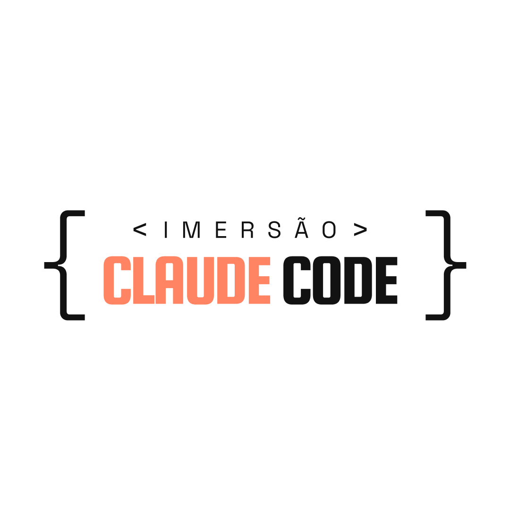

<p align="center">
  
</p>

# Claude Pro Framework

Framework guiado para criar e vender projetos de IA usando Claude Code — sem precisar saber programar.

Desenvolvido por Ana Paula Perci para os alunos da **Imersão Claude Code Pro** (NexIA Lab · PERCI Educação e Tecnologia).

---

## Pra quem é

- Profissionais de qualquer área que querem criar produtos digitais com IA
- Consultores, freelancers e agências que querem entregar projetos mais rápido
- Alunos da Imersão Claude Code Pro
- Qualquer pessoa que quer aprender a trabalhar com Claude Code de forma profissional

Você não precisa saber programar. O framework te guia passo a passo, do primeiro comando até o projeto no ar.

---

## O que você ganha

- **12 comandos guiados** (`/iniciar`, `/ideia`, `/prd`, `/construir`, `/deploy`, `/agente`, `/revisar`, `/corrigir`, `/refatorar`, `/debug`, `/retomar`, `/status`)
- **Skill de revisão de frontend** (`/review-frontend`) com auditoria de botões, cores, responsividade, acessibilidade e código
- **Templates prontos** de `PRD.md`, `TASKS.md` e `CLAUDE.md` com as melhores práticas
- **6 checklists** cobrindo o fluxo completo: identificação de projeto, construção, deploy, refinamento de agente, entrega pro cliente e precificação
- **Design system** com tokens (cores, fontes, espaçamentos, breakpoints) prontos pra usar
- **Documentação de gestão de contexto** com 10 regras pra economizar até 50% de tokens
- **Stack pré-configurada** (Next.js 14 + TypeScript + Tailwind + Shadcn/ui + Supabase + Framer Motion)
- **Banner ASCII** ao abrir o Claude Code (via `SessionStart` hook)
- **Permissions e regras** do Claude Code já configuradas no `settings.json`

---

## Pré-requisitos

Antes de começar, instale:

- **Node.js 20+** ([nodejs.org](https://nodejs.org))
- **Git** ([git-scm.com](https://git-scm.com))
- **Claude Code** ([code.claude.com](https://code.claude.com))
- Uma conta no **GitHub** ([github.com](https://github.com))
- Uma conta no **Supabase** ([supabase.com](https://supabase.com)) — gratuita
- Uma conta na **Vercel** ([vercel.com](https://vercel.com)) — gratuita

---

## Como começar

### 1. Use este template

Clique em **Use this template** no topo desta página (botão verde do GitHub) e dê um nome ao seu projeto novo.

### 2. Clone na sua máquina

```bash
git clone https://github.com/SEU-USUARIO/SEU-PROJETO.git
cd SEU-PROJETO
```

### 3. Abra o Claude Code na pasta

```bash
claude
```

Ao abrir, um banner ASCII aparece. Isso confirma que o framework está ativo.

### 4. Rode o primeiro comando

```
/iniciar
```

O Claude Code analisa o projeto e apresenta o plano. A partir daí, ele te guia a cada etapa.

---

## Fluxo completo (do zero ao projeto no ar)

```
/iniciar     →  Analisa e apresenta o plano
/ideia       →  Entrevista pra descobrir o que construir (se não sabe ainda)
/prd         →  Gera o PRD a partir da sua ideia
/construir   →  Implementa task por task, pedindo aprovação
/revisar     →  Revisão rigorosa antes de entregar
/deploy      →  Guia passo a passo: GitHub + Supabase + Vercel
/agente      →  (Opcional) Cria o prompt de um agente de IA profissional
```

Quando o contexto encher, faça `/compact` manual e depois `/retomar`.

---

## Comandos disponíveis

| Comando | Quando usar |
|---|---|
| `/iniciar` | Primeiro comando ao abrir o Claude Code |
| `/ideia` | Ainda não sabe o que construir |
| `/prd` | Tem a ideia, quer gerar o PRD completo |
| `/construir` | Começar a construção task por task |
| `/deploy` | Publicar o projeto (Supabase + Vercel + GitHub) |
| `/agente` | Criar o prompt de um agente de IA |
| `/revisar` | Revisão completa antes da entrega |
| `/corrigir` | Resolver um bug pontual |
| `/refatorar` | Melhorar código que funciona mas tá feio |
| `/debug` | Investigação profunda de erro |
| `/retomar` | Perdeu contexto? Recomeça sem relê tudo |
| `/status` | Ver onde parou e o que falta |
| `/review-frontend` | Auditoria visual e de código do frontend |

---

## Estrutura do framework

```
.
├── .claude/
│   ├── commands/          # 12 comandos slash guiados
│   ├── skills/
│   │   └── review-frontend/   # Skill de auditoria de frontend
│   ├── hooks/
│   │   └── welcome.sh     # Banner ASCII no SessionStart
│   └── settings.json      # Permissions e hooks do Claude Code
├── docs/
│   ├── checklists/        # 6 checklists (identificação, construção, deploy, agente, entrega, precificação)
│   └── referencias/       # Gestão de contexto, stack, links úteis
├── src/
│   └── styles/
│       └── design-tokens.ts   # Tokens: cores, fontes, spacing, breakpoints
├── CLAUDE.md              # Regras do projeto (lido em toda sessão)
├── PRD.md                 # Template do Product Requirements Document
├── TASKS.md               # Template de tasks e subtasks
├── .env.example           # Variáveis de ambiente (Supabase)
├── .gitignore
└── README.md
```

---

## Stack recomendada

| Tecnologia | Função |
|---|---|
| **Next.js 14 (App Router)** | Framework React com rotas baseadas em arquivo e API routes embutidas |
| **TypeScript** | Tipagem estática — o Claude Code erra menos com tipos |
| **Tailwind CSS** | Estilização utilitária direto no markup |
| **Shadcn/ui** | Componentes prontos (button, input, modal, etc.) |
| **Supabase** | Banco Postgres + auth + storage, tudo em uma plataforma |
| **Framer Motion** | Animações suaves |
| **Lucide React** | Ícones SVG leves |
| **Vercel** | Deploy em 2 cliques |

Por quê essa stack? Tudo funciona junto sem configuração complexa. O Claude Code conhece essas tecnologias em profundidade. Deploy gratuito pra projetos pequenos e médios. Escalável quando o projeto crescer.

---

## Design system

Os tokens estão em [`src/styles/design-tokens.ts`](./src/styles/design-tokens.ts):

- Cor primária: `#46347F` (roxo NexIA)
- Background: `#f4f3f8`
- Fontes: **Syne** (display) + **DM Sans** (body)
- Mobile-first, responsivo
- Sem emojis na interface

---

## Documentação

- [Gestão de contexto](./docs/referencias/gestao-contexto.md) — 10 regras pra economizar tokens
- [Stack](./docs/referencias/stack.md) — por que cada tecnologia
- [Links úteis](./docs/referencias/links-uteis.md) — docs oficiais e repositórios de referência
- [Todos os checklists](./docs/checklists/todos-checklists.md) — do primeiro contato à entrega

---

## Economizando tokens (leitura obrigatória)

O Claude Code tem uma janela de contexto finita. Quando enche, a qualidade cai e o custo sobe. Com práticas simples você economiza até 50%:

1. Uma task por sessão — commite e inicie sessão nova
2. `/compact` manual a 50% do contexto — nunca use auto-compact
3. Prompts curtos e diretos — nada de `"eu estava pensando que talvez..."`
4. Referencie por caminho — `@/components/Header.tsx`, não `"aquele componente do header"`
5. Não peça pra listar tudo — peça só o arquivo que precisa

Detalhes em [`docs/referencias/gestao-contexto.md`](./docs/referencias/gestao-contexto.md).

---

## Configuração do `.env`

Copie `.env.example` pra `.env.local` e preencha com suas credenciais do Supabase:

```bash
cp .env.example .env.local
```

```
NEXT_PUBLIC_SUPABASE_URL=https://seu-projeto.supabase.co
NEXT_PUBLIC_SUPABASE_ANON_KEY=sua-anon-key-aqui
SUPABASE_SERVICE_ROLE_KEY=sua-service-role-key-aqui
```

O `.env.local` está no `.gitignore` — nunca será commitado.

---

## Perguntas frequentes

**Precisa saber programar?**
Não. O framework te guia passo a passo. Você lê, responde e aprova. O Claude Code implementa.

**Custa quanto usar o Claude Code?**
Claude Code é um produto pago da Anthropic. Planos a partir de USD 20/mês no Pro. Detalhes em [claude.com/pricing](https://claude.com/pricing).

**Posso usar em projetos comerciais?**
Sim. A licença é pra uso exclusivo dos alunos da Imersão, mas os projetos que você construir com o framework são seus.

**E se eu travar?**
Use `/retomar` pra recuperar contexto. Use `/debug` pra investigar erros. Se persistir, fale no grupo da Imersão.

---

## Licença

Uso exclusivo dos alunos da **Imersão Claude Code Pro**.

© 2026 Ana Paula Perci — PERCI Educação e Tecnologia.

---

## Crédito

Criado por [Ana Paula Perci](https://anapaulaperci.com) — NexIA Lab · PERCI.
